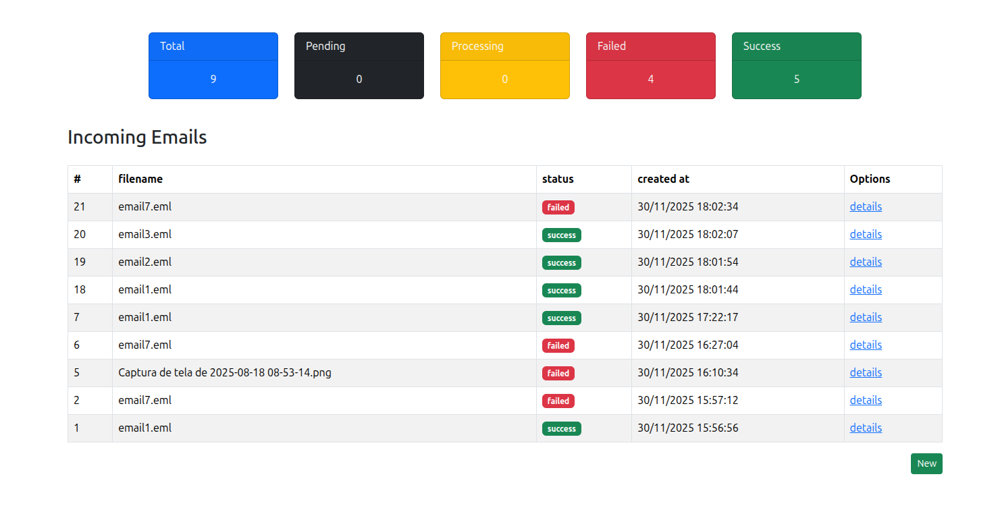
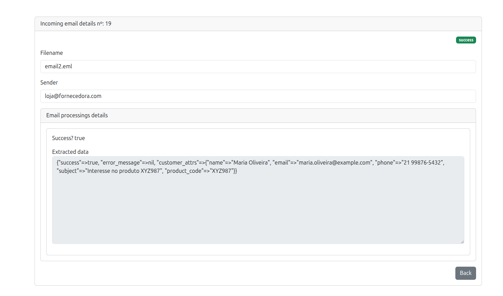

# Guia de Instalação e Execução do Projeto

Pré-requisitos Essenciais
Antes de começar, certifique-se de que sua máquina tenha os seguintes softwares instalados:

Git: Para clonar o repositório. 
Docker: Incluindo o Docker Compose.

* Clonagem do Repositório

    Abra seu terminal e clone o código-fonte do projeto usando Git:

<pre>
    git clone https://github.com/victor9743/parser_eml.git
    cd parser_eml
</pre>

* Configuração do Docker Compose

    O arquivo docker-compose.yml define três serviços: web (Rails), db (PostgreSQL) e redis.
    Rode os comandos para criar a imagem Docker para o serviço web (Rails) e iniciar todos os serviços em segundo plano:

<pre>
    docker compose build
    docker compose up -d
</pre>

* Configuração do Banco de Dados

    Execute estes comandos no terminal, direcionando-os para o container web:

# Cria o banco de dados

<pre>
    docker compose exec web bundle exec rails db:create
</pre>

# Executa as migrações (cria as tabelas)
<pre>
    docker compose exec web bundle exec rails db:migrate
</pre>

* Execução e Uso

A aplicação Rails está disponível no navegador:

<pre>
    URL: http://localhost:3000
</pre>

* Execução de Testes (RSpec)

Para rodar todos os testes e confirmar que o ambiente está configurado corretamente (incluindo a integração com o Sidekiq/Redis no modo de teste):

<pre>
    docker compose exec web bundle exec rspec
</pre>

# Como enviar um e-mail .eml para processamento.

 em seu ambiente vá para: <pre>incoming_emails/new</pre>. Após isso, adicione o arquivo .eml no campo .eml file e depois disso, clique em send. Ao realizar este procedimento, você será redirecionado para a rota rails do projeto.

# Como visualizar os resultados (customers + logs).

 Cada solicitação feita, será visualizada na rota raiz do projeto. Para visualizar os resultados, clique na opção details. Nesta opção, terá
todos as informações da solicitação, inclusive os logs.Se houver algum falha na solicitação, será mostrado o retorno do erro.

# Tecnologias Utilizadas

Ruby on Rails

PostgreSQL

Redis

Docker

RSpec

# UI e UX do Aplicativo

O aplicativo foi desenvolvido seguindo princípios de simplicidade, clareza e navegação intuitiva, garantindo que qualquer usuário consiga interagir sem dificuldade.

* Funciona como o esperado
* Cada arquivo .eml enviado é processado automaticamente.
* O usuário visualiza rapidamente a situação de todos os processamentos no dashboard.
* Os detalhes de cada e-mail são exibidos de forma clara, com mensagens de sucesso ou erro.
* Navegação Clara
* O menu e os botões seguem um padrão visual consistente.
* O botão New sempre leva ao formulário de upload.
* O botão details permite visualizar informações completas sobre o processamento.
* O botão Back está presente em todas as telas para facilitar retorno ao início.
* Interface Intuitiva e Fácil de Usar

* Cards com cores destacam o status geral:
Azul == total,
Preto == pendentes,
Amarelo == em processamento,
Vermelho == falhas,
Verde == sucessos,

* A tabela exibe informações essenciais: filename, status, created_at e opções.

* Ícones e cores ajudam a identificar rapidamente o estado de cada e-mail.

* Campos de leitura (como sender e mensagens de erro) aparecem em caixas ampliadas, facilitando a leitura.

# Abaixo é possível visualizar como a interface se comporta na prática:

* Tela Inicial

* Formulário de Entrada

* Requisição bem sucedida

* Requisição mal sucedida
